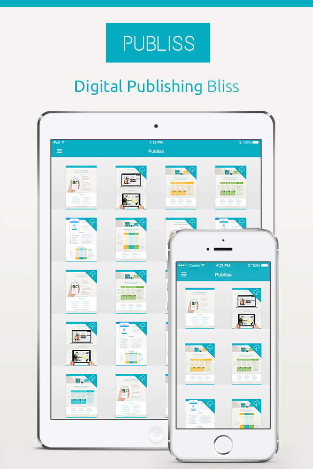

How To Get Started
==================

#### PUBLISS Digital Publishing Bliss
- [Visit Publiss Website](http://publiss.com "Visit Publiss Website")
- [Publiss App](http://appstore.com/publiss "Publiss App")

## Table of Contents   

- [Why Publiss?](#why-publiss)
- [Installation](#Installation)
- [Requirements](#Requirements)

## Why Publiss
Publiss enables you to enrich PDFs with multimedia content and publish them to a high-quality iPhone and iPad App - all by yourself.

##### Kiosk App
- Give a high-quality native iOS App to your readership
- Start reading instantly even in large documents with PDF Streaming
- Configure and brand it by yourself or get help from Publiss Service
- Extra features are available on request

##### Publiss Online
- [Visit Publiss Backend](https://backend.publiss.com "Visit Publiss Backend")
- Publish PDFs anytime and anywhere
- Easily enrich PDFs with multimedia content (Videos, Audio, Picture Galleries and URLs)
- Analyze detailed usage data with Publiss Statistics

## Screenshots
###iPhone and iPad

## Installation
 - Get Publiss sourcecode from https://github.com/Publiss/Publiss-Whitelabel-iOS
 - Install CocoaPods http://guides.cocoapods.org/using/getting-started.html 
 - Install dependencies with CocoaPods in publiss-whitelabel-ios root folder with `$ pod install`
 - Open Publiss.xcworkspace in Xcode 5.1 or newer
 - Login at https://backend.publiss.com/
 - Select "Apps" button (left side menu)
 - Click on your app
 - Copy the "App Secret", "App Token"
 - Edit the Config.plist found in "Supporting Files" Folder in Xcode with "App Secret" & "App Token"
 - Optional: edit the Design.plist file to customize the look & feel
 - Run Project in Xcode (iOS 7+ only, iPhone, iPad)
 
###Requirements:
 - Publiss requires Xcode 5.1 or higher, targeting iOS 7 (iPad and iPhone) and above.

## License

The MIT License (MIT)

Copyright (c) 2014 Publiss GmbH (http://publiss.com)

Permission is hereby granted, free of charge, to any person obtaining a copy
of this software and associated documentation files (the "Software"), to deal
in the Software without restriction, including without limitation the rights
to use, copy, modify, merge, publish, distribute, sublicense, and/or sell
copies of the Software, and to permit persons to whom the Software is
furnished to do so, subject to the following conditions:

The above copyright notice and this permission notice shall be included in
all copies or substantial portions of the Software.

THE SOFTWARE IS PROVIDED "AS IS", WITHOUT WARRANTY OF ANY KIND, EXPRESS OR
IMPLIED, INCLUDING BUT NOT LIMITED TO THE WARRANTIES OF MERCHANTABILITY,
FITNESS FOR A PARTICULAR PURPOSE AND NONINFRINGEMENT. IN NO EVENT SHALL THE
AUTHORS OR COPYRIGHT HOLDERS BE LIABLE FOR ANY CLAIM, DAMAGES OR OTHER
LIABILITY, WHETHER IN AN ACTION OF CONTRACT, TORT OR OTHERWISE, ARISING FROM,
OUT OF OR IN CONNECTION WITH THE SOFTWARE OR THE USE OR OTHER DEALINGS IN
THE SOFTWARE.
